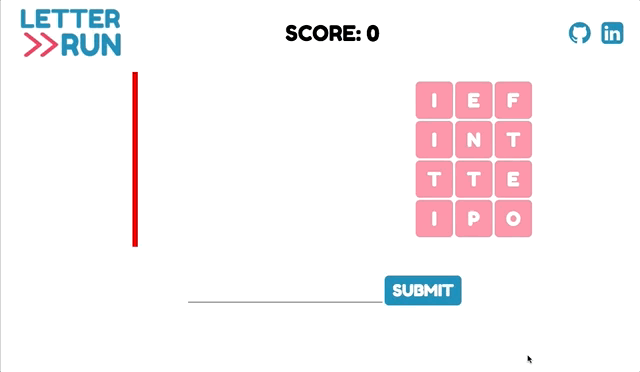

# Letter Run

[Play Letter Run!](https://virginiac32.github.io/letter-run)

## Background

Letter Run is a one-player anagram word game that is inspired by scrabble and other online word games, created by Virginia Chen. Letter Run was built using vanilla JavaScript and jQuery.

### Gameplay



Letter Run starts with a group of letter tiles moving towards the left of the screen. As letters move left, new letters move in from the right. Type out words (with a minimum of 3 characters) that can be formed from the letters on the screen to clear those letters!

If the word is valid, those letters disappear from the screen and you gain points, with longer words being worth more points. The tiles speed up as the player's score increases. The game is over when a letter tile hits the red line on the left of the screen.

## Technologies

Letter Run was built using:
* JavaScript for the overall structure and game logic
* `jQuery` for DOM manipulation
* `webpack` to bundle the various scripts

## Features

#### Letter Tile Elements

Tiles are a series of `<li>` elements in a larger `<ul>` element. The `<ul>` element is cleared and re-rendered each step.

```javascript
render() {
  let $ul2 = document.getElementById("all-tiles");
  $ul2.remove();

  const $ul = $("<ul>");
  $ul.attr('id','all-tiles');
  for (let rowIdx = 0; rowIdx < 3; rowIdx++) {
    for (let colIdx = 0; colIdx < 10; colIdx++) {
      let $li = $("<li>");
      $li.data("pos", [rowIdx, colIdx]);
      if (this.game.board.grid[rowIdx][colIdx]) {
        $li.attr('data-letter', this.game.board.grid[rowIdx][colIdx].letter);
        $li.addClass("tile");
      }

      $ul.append($li);
    }
  }

  $(this.$el).append($ul);
}
```

#### Letter Tiles and Word Validation
Letter tiles are generated randomly, based on the frequency of the letters in the English language.

When the user inputs a word, the word needs to be in the Word List and also have all its letters on the board to be an acceptable word.

```javascript
// returns true if all the letters for the word are on the screen
validWord(word) {
  let allLetters = [];
  for (let i = 0; i < this.grid.length; i++) {
    for (let j = 0; j < this.grid[0].length; j++) {
      if (this.grid[i][j]) {
        allLetters.push(this.grid[i][j].letter);
      }
    }
  }
  for (let i = 0; i < word.length; i++) {
    if (allLetters.indexOf(word[i]) === -1) {
      return false;
    } else {
      let index = allLetters.indexOf(word[i]);
      allLetters.splice(index, 1);
    }
  }
  return true;
}
```

Then, the game scans the letter tiles starting from the upper left and removes the letters in the word.

```javascript
// clear the letters of the word from the list of letters on the screen
clearWord(word) {
  let tempWord = word;
  tempWord = tempWord.toUpperCase().split('');
  tempWord.forEach((el) => {
    let removed = false;
    for (let i = 0; i < this.grid[0].length; i++) {
      for (let j = 0; j < this.grid.length; j++) {
        if (!removed && this.grid[j][i]) {
          if (this.grid[j][i].letter === el) {
            this.grid[j][i] = null;
            removed = true;
          }
        }
      }
    }
  });
}
```

#### Word List
The English Open Word List (EOWL) is used as the word list. A text file of the list is being hosted on Amazon Web Services, and the words are pulled into an array at the start of each game. Each time the player enters a word, that word is checked against the word list, and only valid words are accepted.

## Future Features
In the future, the game can be expanded to include the following features:
* Smooth, gradual stepping of the tiles to the left
* A leaderboard for high scores
* Multiplayer mode to compete against other people

# Scoring

|Word Length   | Points   |
|-------|------------------|
| 3 | 5 |
| 4 | 10 |
| 5 | 15 |
| 6 | 25 |
| 7 | 35 |
| 8 | 45 |
| 9 | 60 |
| 10+ | 70 |

# Credits

The English Open Word List (EOWL) was used to validate words in this game: http://dreamsteep.com/downloads/word-games-and-wordsmith-utilities/120-the-english-open-word-list-eowl.html

The Cornell University Math Explorer's Project's English letter frequency table was used to calculate the generated letters: [frequency-table](http://www.math.cornell.edu/~mec/2003-2004/cryptography/subs/frequencies.html)

Tones from RCP Tones (dev_tones) ([CC BY 3.0 US](https://creativecommons.org/licenses/by/3.0/us/)): http://rcptones.com/dev_tones/#tabr1

Arrows graphic by <a href="http://www.flaticon.com/authors/elegant-themes">elegant_themes</a> from <a href="http://www.flaticon.com/">Flaticon</a> is licensed under <a href="http://creativecommons.org/licenses/by/3.0/" title="Creative Commons BY 3.0">CC BY 3.0</a>. Check out the new logo that I created on <a href="http://logomakr.com" title="Logo Maker">LogoMaker.com</a> https://logomakr.com/3cTBYE3cTBYE
